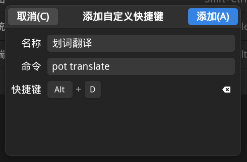
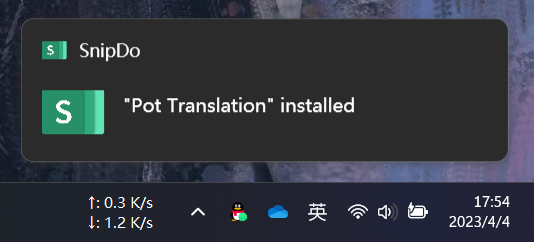

# 配置

首次运行会自动弹出设置页面，如果没有弹出，请点击托盘图标-设置进行设置

按照需求填写之后点击右下角保存设置即可。

## 快捷键设置

1. 直接输入快捷键名称即可

   格式：[Key1]+[Key2]+[Key3]

   如：Ctrl+D，Ctrl+Shift+D

   > 暂时请只使用 Ctrl Alt Shift 的组合键，Tab,Super,Space 等经过测试并不可用

2. 使用系统快捷键

   在 wayland 或全局快捷键无法生效的平台下，可以在软件设置中将快捷键留空，使用系统的快捷键设置
   对应的命令为：

   ```bash
   pot translate # 划词翻译
   pot persistent # 独立窗口
   ```

   例如 Gnome 下的设置如图所示：
   

## 插件调用

### SnipDo(Windows)

1. 在[Microsoft Store](https://www.microsoft.com/store/productId/9NPZ2TVKJVT7)下载安装 SnipDo
2. 到[Github Release](https://github.com/Pylogmon/pot/releases)下载 pot 的 SnipDo 扩展`pot.pbar`
3. 双击安装，出现安装成功即可使用
   
4. 如果划词后不出现图标可以去软件设置中启用 pot:
   

### PopClip(MacOS)

1. 安装[PopClip](https://pilotmoon.com/popclip/)
2. 下到[Github Release](https://github.com/Pylogmon/pot/releases)载 pot 的 PopClip 插件`Pot.popclipextz`
3. 安装下载的插件
4. 在 PopClip 菜单中启用 Pot 插件

## Anki

由于 AnkiWeb 并没有开放的 API，所以要支持 Anki 只能通过 Anki 客户端插件 `AnkiConnect`

### 配置步骤

### 安装 `AnkiConnect` 插件

1. 打开 Anki 客户端
2. 工具-插件-获取插件
3. 填入 `AnkiConnect` 插件 id `2055492159`，确认后安装
4. 重启 Anki 客户端生效
   更多 `AnkiConnect` 相关信息可以查阅[AnkiConnect 官网](https://foosoft.net/projects/anki-connect/)

### 安装 `Minimize to tray` 插件(可选)

由于 `AnkiConnect` 需要 Anki 客户端保持运行，而 Anki 客户端又没有后台运行的功能，所以需要借助插件使其可以最小化到托盘

1. 打开 Anki 客户端
2. 工具-插件-获取插件
3. 填入 `Minimize to tray` 插件 id `85158043`，确认后安装
4. 重启 Anki 客户端生效

### 在 Pot 中启用 Anki 支持

1. Pot-设置-应用设置-启用 Anki 支持

配置完成之后，翻译面板会出现添加到 Anki 图标，点击即可将本次翻译内容添加到 Anki。

> 注意需要 Anki 客户端保持后台运行

## 设置无效导致软件启动失败

如果设置了不可用的快捷键，或者设置文件经过手动修改后出现格式问题，应用会无法启动，这时候需要手动删除设置文件后再重新启动应用。

设置文件路径：

- Linux `$XDG_CONFIG_HOME/cn.pylogmon.pot/config.toml` or `$HOME/.config/cn.pylogmon.pot/config.toml`
- Windows `C:\User\{用户名}\AppData\Roaming\cn.pylogmon.pot\config.toml`
- MacOS `$HOME/Library/Application Support/cn.pylogmon.pot/config.toml`

<CommentService />
