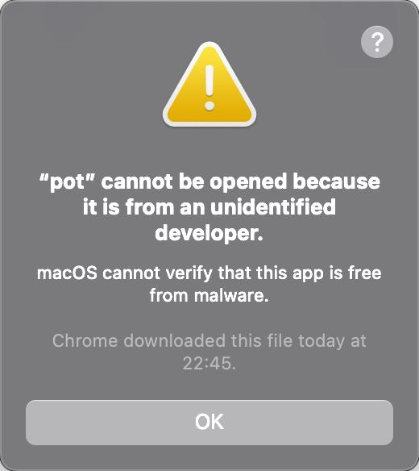

# FAQ

## 配置文件存储位置

- Linux `$XDG_CONFIG_HOME/com.pylogmon.pot/config.toml` or `$HOME/.config/com.pylogmon.pot/config.toml`
- Windows `C:\User\{用户名}\AppData\Roaming\com.pylogmon.pot\config.toml`
- MacOS `$HOME/Library/Application Support/com.pylogmon.pot/config.toml`

## 一些常见的闪退原因

### 1. 系统 glibc/openssl 版本过低(Linux)

- 原因

  系统的 glibc 或 openssl 版本过低，默认的 deb 包是在 Ubuntu22.04 上编译的，需要`glibc>=2.34`,`openssl=3.x`

- 解决方案

  Release 中另外提供了使用 Debian10 编译的 deb 包`pot_<version>_amd64_universal.deb`，需要`glibc=2.28`,`openssl=1.1`，请根据实际情况选择对应的包来安装。

### 2. 被杀毒软件删除(Windows)

- 原因

  软件被某些杀毒软件误报，作者目前遇到过两次，还不清楚具体的原因，看 tauri 的 issue,也有遇到同样问题的人，但目前还没发现具体的原因。

- 解决方案

  在杀毒软件中还原，并将软件加入白名单

### 3. 禁用或删除了系统 WebView2(Windows)

- 原因

  Tauri 框架依赖于 WebView2，如果卸载或禁用了 WebView2，将无法显示界面，表现为 pot 可以启动，但是点击托盘菜单没有反应。

- 解决方案

  如果是利用第三方软件禁用了 Edge，请检查是否同时禁用了 WebView2，将 WebView2 取消禁用。

  如果是卸载了 WebView2，可以在微软官网下载安装包重新安装 WebView2。

### 4. 配置文件格式错误

- 原因

  如果设置了不可用的快捷键，或者因为各种原因(你自己修改、或者软件异常退出)导致配置文件格式不正确，软件将无法启动。

- 解决方案

  备份配置文件之后将原配置文件删除，再次打开应用就正常了。配置文件位置见 [配置文件存储位置](/docs/tutorial/faq#配置文件存储位置)

## MacOS

打开文件提示`“pot”无法打开，因为它来自身份不明的开发者。`

- 原因

  MacOS 默认不允许打开身份不明的应用

- 解决方案 1:

  打开 `系统偏好设置` -> `安全性与隐私` -> `通用`，在 `允许从以下位置下载的应用` 中选择 `任何来源`，然后再次打开应用。

> 如果发现没有 `任何来源` 选项, 请在终端输入 `sudo spctl --master-disable` 并输入密码回车后.  
> 重新打开 `系统偏好设置` -> `安全性与隐私` -> `通用`，在 `允许从以下位置下载的应用` 中选择 `任何来源`，然后再次打开应用。

- 解决方案 2:

打开 `Applications` 目录, 按住 `control` 键, 点击 `pot.app` , 选择 `打开` , 然后再次打开应用.
